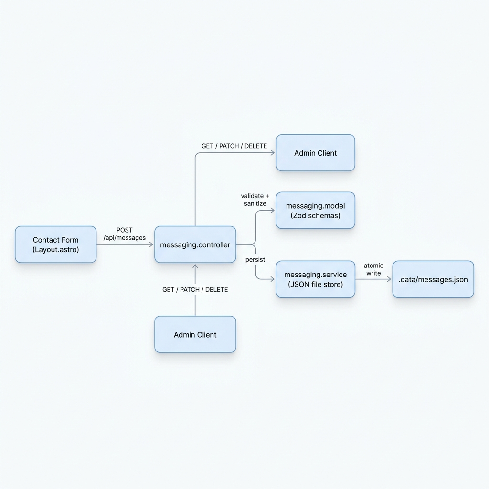

# Local Messaging Inbox — Feature Implementation

## Architecture

The feature replaces the previous email-sending (`nodemailer` → SMTP) contact workflow with a fully local, server-side message store. **Zero external network calls.**



## Deliverables

| Deliverable | Path | Purpose |
|---|---|---|
| **Model** | `src/lib/messaging/messaging.model.ts` | Zod schemas, types, sanitization |
| **Service** | `src/lib/messaging/messaging.service.ts` | JSON file CRUD, atomic writes, concurrency guard |
| **Controller** | `src/lib/messaging/messaging.controller.ts` | HTTP handlers, validation, JSON responses |
| **Routes** | `src/pages/api/messages/index.ts`, `src/pages/api/messages/[id].ts` | Astro API route wiring |
| **Barrel** | `src/lib/messaging/index.ts` | Clean module boundary export |
| **Tests** | `src/tests/messaging.test.ts` | 20 unit tests (model + service) |
| **Updated Form** | `src/layouts/Layout.astro` | POSTs to `/api/messages` |

## API Contract

### Public

| Method | Endpoint | Body | Response |
|---|---|---|---|
| `POST` | `/api/messages` | `{ name, email, message, website? }` | `201` with `{ message, id }` |

### Admin (CRUD)

| Method | Endpoint | Body | Response |
|---|---|---|---|
| `GET` | `/api/messages` | — (query: `?status=unread\|read\|archived`) | `{ count, messages[] }` |
| `GET` | `/api/messages/:id` | — | Single `MessageRecord` |
| `PATCH` | `/api/messages/:id` | `{ status: "unread"\|"read"\|"archived" }` | Updated record |
| `DELETE` | `/api/messages/:id` | — | `{ message: "Message deleted" }` |

## Data Model

```typescript
{
  id: string;           // UUID v4
  timestamp: string;    // ISO 8601
  sender_name: string;  // sanitized
  sender_email: string; // normalized lowercase
  message_body: string; // sanitized
  status: "unread" | "read" | "archived";
}
```

## Non-Functional Requirements Met

| Requirement | Implementation |
|---|---|
| **Input sanitization** | HTML entity escaping via Zod `.transform()` on all text fields |
| **Injection-safe** | No SQL/template injection surface — JSON file store with `JSON.parse`/`JSON.stringify` |
| **Atomic writes** | Write to `.tmp` file → `fs.renameSync` (POSIX atomic on same filesystem) |
| **Clear module boundaries** | Model → Service → Controller layering with barrel export |
| **No email / no network** | `nodemailer` + SMTP removed from the contact flow entirely |

## Config Changes

- `astro.config.mjs`: Added `@astrojs/node` adapter for server-rendered API routes
- `.gitignore`: Added `.data/` exclusion
- `src/tests/contact.test.js`: Updated honeypot field assertion (`honeypot` → `website`)

## Test Results

```
Test Files  8 passed (8)
     Tests  51 passed (51)
  Duration  1.62s
```

> **Note:** The existing `src/pages/api/contact.ts` (nodemailer-based endpoint) is still present but no longer referenced by the frontend form. It can be removed when ready.
